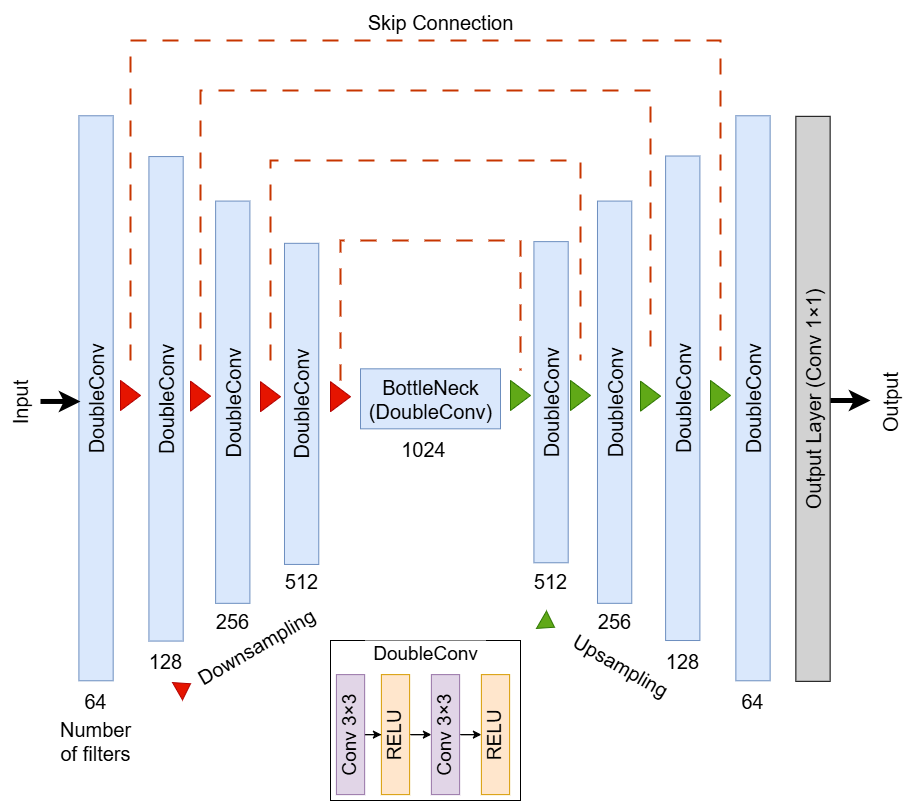

# 🌧️ Optimizing Input-Output Configurations for Deep Learning-Based Rainfall Nowcasting

This repository provides code for the paper:

**"An Explainable Framework for Optimizing Input–Output Configuration in Deep Learning-Based Rainfall Nowcasting"**

This study evaluates deep learning-based rainfall nowcasting models under varying input–output configurations, focusing on explainability and performance across different temporal settings.

A unified encoder–decoder architecture inspired by U-Net is used. The model is trained, validated, and evaluated on five years (2016–2020) of UK radar data at 5-minute intervals and 1 km resolution, with a spatial grid size of 512 × 512.

The model supports multiple input–output configurations:

- **Input configurations**: 2, 3, 4, 6, 8, 10, 12, and 24 past rainfall frames.
- **Output modes**:
  - **1-frame output**: Predict 1 frame at a time recursively (12 steps).
  - **6-frame output**: Predict the first 6 frames in one step, then 6 more recursively.
  - **12-frame output**: Predict all 12 future frames in one forward pass.

In total, 24 input–output configurations are tested to identify the optimal setup for deep learning-based rainfall nowcasting.
---
📄 See below for instructions on running the models. For further details, please refer to the paper or contact the author.

#  📁 Project Structure

├── run_predictions.py       # Main evaluation script  
├── utils.py                 # Utilities for loading, scaling, plotting, inference  
├── metrics/                 # MAE, RMSE, CSI metric functions  
├── nowcast_unet/            # U-Net-based 2D CNN model  
├── checkpoints/             # Pretrained weights by input configuration  
├── sample_data/             # Sample radar sequences  
├── sequence_builder.py      # Builds radar input/output sequences  
├── requirements.txt         # pip environment  
├── environment.yml          # conda environment  
└── README.md                # Project documentation  

# 📦 Pretrained Models

Pretrained weights for the models used in this study are archived on Zenodo:  

#  💻 Setup & Requirements

1. **Clone the repository**:
     
   git clone https://github.com/HydroAI/InputOutputNowcasting.git
   cd InputOutputNowcasting

3. Install required  packages:

You can use either pip or conda:

🔹 Option A – Using pip

pip install -r requirements.txt

🔹 Option B – Using conda (recommended for reproducibility)

conda env create -f environment.yml
conda activate nowcast-env

3. Add model checkpoints
Download pretrained model weights and place them into the appropriate folders:

For example:
- `checkpoints/2in/weights-best.pth`
- `checkpoints/4in/weights-best.pth`
- ...
- `checkpoints/12in/weights-best.pth`

> 🔎 Note: The code is already included via the cloned repository.

#  🚀 Usage

1. Run the evaluation script

python run\_predictions.py

This runs inference and evaluation on the radar sequences for all selected models and saves outputs to the outputs/ folder.

#  ⚙️ Input–Output Configuration
Inside run_predictions.py, configure:

Input frame settings using model_config:
model_config = {
    2: {"slice": slice(22, 24), ...},
    3: {"slice": slice(21, 24), ...},
    ...
}

Output setting using:
n_output_frames = 1  # Options: 1, 6, or 12

Where:

1 → Recursive prediction (1 frame at a time, 12 steps)
6 → Predict 6 frames + recursively predict next 6
12 → Full 12-frame prediction in one forward pass

#  📊 Outputs and Visualization

The script generates:

✅ .gif animations: Observed vs. predicted rainfall
✅ Grid plots comparing multiple model predictions
✅ MAE, RMSE, and CSI scores over time
✅ Thresholded CSI plots for multiple rain rate thresholds

All outputs are saved to the outputs/ directory.

#  📄 License

This project is open-source under the MIT License. See LICENSE for details.

#  📬 Contact

For questions or collaborations, contact:

Ahmed Abdelhalim

University of Bristol

✉️ ahmed.abdelhalim@bristol.ac.uk

✉️ ahmed_abdelhalim@mu.edu.eg

🔗 https://github.com/Ahmed-HydroAI

